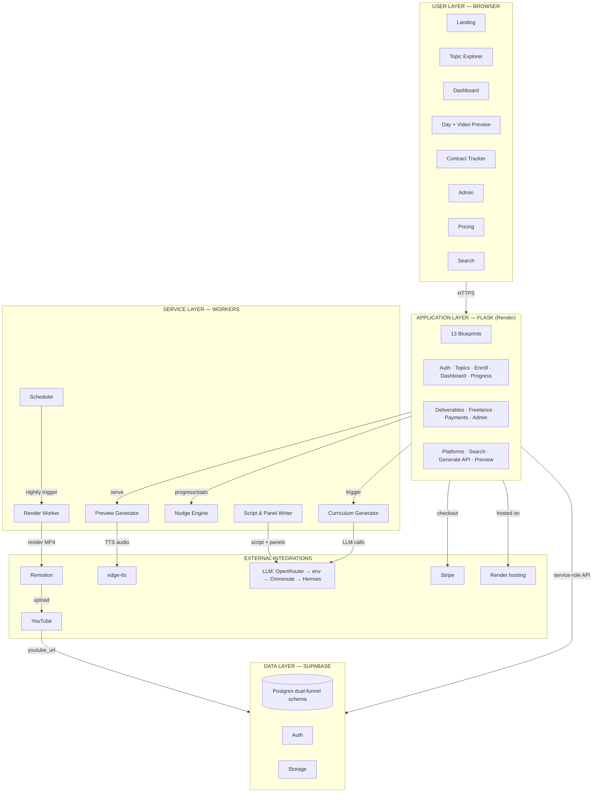
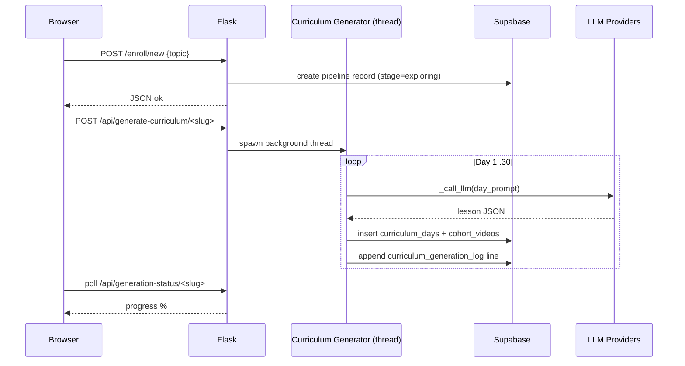

# FreelanceLaunch — Architecture

**Status:** Active · **Version:** 1.0 · **Last updated:** 2026-08-03 · **Owner:** Dhruba

> Companion spec: [`engineering-spec.md`](./engineering-spec.md)
> Editable diagrams: [`architecture.drawio`](./architecture.drawio) — open with [diagrams.net](https://app.diagrams.net) (draw.io) or VS Code + *Draw.io Integration* extension.
> Repository: `web-app/` → `git@github.com:Djd11/freelancelaunch.git` (private, `origin` on `main`). This doc + the `.drawio` file live in the parent folder, outside the repo.

---

## 1. Overview

FreelanceLaunch is a **server-rendered Flask monolith** on top of **Supabase (Postgres + Auth)**, with a set of background workers that turn LLM output into structured 30-day curricula and (optionally) into YouTube videos. The architecture is deliberately boring: free-tier hosting, no build step, no microservices — one deployable app plus lightweight worker scripts.

The three pillars of the design:

1. **Server-side curriculum generation** — LLM-driven, but with a fallback chain that guarantees content even with zero API keys configured.
2. **Cohort-based video production** — one Remotion render per day per cohort serves an unlimited number of users, and doubles as YouTube content (organic acquisition for Funnel 1).
3. **Pure-HTML previews** — the daily lesson has a zero-cost animated HTML + TTS preview that works instantly; the expensive MP4 is produced overnight for distribution.

---

## 2. Architecture Principles

| # | Principle | Consequence |
|---|-----------|-------------|
| 1 | **Free-tier economics** | Everything must run on $0–15/mo: Render free, Supabase free, OpenRouter free models, local Remotion rendering |
| 2 | **No-500 philosophy** | Every user-facing path must degrade gracefully (fallback lessons, async generation, redirects) |
| 3 | **Cohort amortization** | Generate once per cohort, serve many (one video/day/cohort) |
| 4 | **Dual-funnel data** | Every touchpoint writes structured data to both acquisition and outcome funnels |
| 5 | **Async generation** | Long LLM work is backgrounded, DB-persisted, and polled — never blocks a request |
| 6 | **Single deployable** | Flask monolith + service layer; workers are functions, not separate servers |

---

## 3. Architecture Diagram (draw.io)

The full system is modeled in **[`architecture.drawio`](./architecture.drawio)** — an editable diagrams.net file with **3 diagrams**:

| Diagram | Content |
|---------|---------|
| `System-Architecture` | 4-layer view: Browser → Flask blueprints → Services → Supabase + external integrations |
| `Video-Production-Pipeline` | The 2 AM nightly run: scheduler → script → TTS → Remotion → YouTube → DB |
| `LLM-Fallback-Chain` | Provider priority order + deterministic fallback path |

**To open:** drag `architecture.drawio` into https://app.diagrams.net, or `code architecture.drawio` with the Draw.io Integration extension. Export to PNG/SVG via *File → Export as*.

### Quick-reference (Mermaid — renders on GitHub)



---

## 4. Layered Architecture

### 4.1 Browser layer
Eight server-rendered Jinja2 views (Tailwind CDN, vanilla JS): landing, topic explorer, dashboard, day lesson + video preview, contract tracker, admin, pricing/checkout, and demand search. No SPA — the app is rendered server-side for SEO on the landing/topic pages (the organic acquisition surface).

### 4.2 Application layer (Flask)
- `app.py` factory registers **13 blueprints**, a `before_request` user loader (`g.user` from session → Supabase), and a context processor injecting user/platform/Stripe globals.
- Auth is session-based over **Supabase Auth** (email/password).
- Endpoints are grouped into **read/UX** (topics, dashboard, preview), **write/API** (`/api/*`), and **admin**.

### 4.3 Service layer (workers)
Pure-ish Python modules callable both in-request (fast: nudge, preview) and in-thread/cron (slow: curriculum generation, Remotion render). They are the only place that talks to LLM providers, TTS, Remotion, and YouTube.

### 4.4 Data layer (Supabase)
Postgres holds the **dual-funnel schema** (see `engineering-spec.md §7`). Access goes through a service-role client (RLS bypassed for MVP). Auth, Storage, and Realtime live beside the database.

### 4.5 External integrations
LLM providers, Stripe, edge-tts, Remotion (local), YouTube Data API, and Render hosting. See diagram tabs in `architecture.drawio`.

---

## 5. Key Data Flows

### 5.1 Enrollment → curriculum generation


### 5.2 Daily dashboard (Learn → Practice → Apply)
`dashboard.home()` reads the user's cohort → today's `cohort_videos` row → `user_progress` → renders the day. The user ticks each section via `POST /api/progress/mark`; `nudge_engine` recomputes streak + confidence and returns encouragement; all three ticks auto-advance the freelance pipeline stage.

### 5.3 Video production (overnight) — see draw.io tab
Scheduler (2 AM) → find active cohorts → tomorrow's lesson → LLM script/panels → edge-tts → `PanelContent.js` → Remotion render → YouTube (stub) → DB `ready`.

### 5.4 Payments
`/payments/pricing` → `/payments/create-checkout` → Stripe session → `/payments/success` verifies session, upgrades tier in `user_profiles` + `user_acquisition`.

---

## 6. Video Production Pipeline

Two parallel video strategies coexist intentionally:

| Strategy | Latency | Cost | Where |
|----------|---------|------|-------|
| **HTML TwoPanel preview** (`preview_generator`) | Instant | $0 (edge-tts, local) | In-app, always works |
| **MP4 Remotion video** (`render_worker`) | ~50–60 min/night | $0 (local render) | YouTube distribution + acquisition |

**Critical constraint** (from `educational-video-gen/SKILL.md`): the number of `PANELS` must exactly equal the number of TTS script sections, or word/panel sync drifts for the rest of the video. This is the #1 production bug — enforce it in `write_panel_content()`.

---

## 7. LLM Fallback Chain

```
Curriculum Generator
  └─ _call_llm(): try providers in order
       1. OpenRouter free  (gemma-4-26b, no key)
       2. vision-tool config.json  (OPENROUTER_API_KEY)
       3. env vars  (LLM_API_URL / LLM_API_KEY / LLM_MODEL)
       4. Omniroute local  (127.0.0.1:20128, socket probe)
       5. Hermes / OpenCode.ai  (~/.hermes/config.yaml)
       6. ❌ all fail → deterministic _fallback_lesson()
```

The app **never 500s** on a missing API key. Each fallback lesson has a 20 s timeout + 4096 max tokens, and failed days are logged to the generation log as `error` without aborting the remaining days.

> ⚠ `generate_api._get_llm_config()` has a parallel provider chain — keep the two in sync.

---

## 8. Deployment Topology

```
┌─────────────── Internet ───────────────┐
│                                        │
│  Browser ──HTTPS──► Render (free tier) │
│                      gunicorn · 2 wk   │
│                      Flask · wsgi.py   │
│                            │           │
│                            ▼           │
│                    Supabase (cloud)    │
└───────────┬──────────────────────┬─────┘
            │                      │
   local dev machine        Render env vars
   scheduler + Remotion     (SECRET_KEY, SUPABASE_*,
   + edge-tts @ 2AM         LLM_*, STRIPE_*, ADMIN_EMAIL)
```

- **App:** Render free tier, `runtime.txt` pins Python 3.11.8, `Procfile` runs `gunicorn wsgi:app` (2 workers, 120 s timeout).
- **Database:** Supabase project; `schema.sql` applied via SQL Editor (idempotent).
- **Video workers:** run on the developer's local machine (Intel HD 3000, ~1.2 fps Remotion) via cron; not part of the Render deployment — an operational dependency to document.
- **Secrets:** injected as Render env vars; `.env` used locally.

---

## 9. Scaling Considerations

| Constraint | Current | When to act |
|-----------|---------|-------------|
| Render free tier | 512 MB RAM, 2 workers | Move to $7/mo paid instance at ~concurrent load |
| Supabase free tier | 500 MB DB, 2 GB bandwidth | Move to Pro at ~500 users |
| gunicorn worker state | In-memory progress tracker is per-worker (DB is source of truth) | Already mitigated; verify with 2 workers |
| Remotion render | ~1.2 fps on Intel HD 3000 (~50–60 min/day) | Rent a GPU renderer or switch to server-side render when cohort count > 3 |
| LLM throughput | Free OpenRouter tier has rate limits | Add queueing + retry/backoff at scale |

---

## 10. Appendix — Using the draw.io file

1. Open https://app.diagrams.net → *File → Open from → Device* → select `architecture.drawio`.
2. Three tabs at the bottom: **System-Architecture**, **Video-Production-Pipeline**, **LLM-Fallback-Chain**.
3. Colors encode layers: 🟣 *Browser* · 🟪 *Flask* · 🟦 *Services* · 🟩 *Supabase* · 🟧 *External* · 🟨 *Notes/warnings*.
4. Keep this file and `architecture.md` in sync when the system changes (new blueprint, new table, new integration).

---

*References: `engineering-spec.md`, `webapp-plan.md`, `.hermes/plans/2026-07-17_video-first-platform-architecture.md`, `.hermes/plans/2026-07-17_leadgen-and-decisions.md`, `educational-video-gen/SKILL.md`.*
