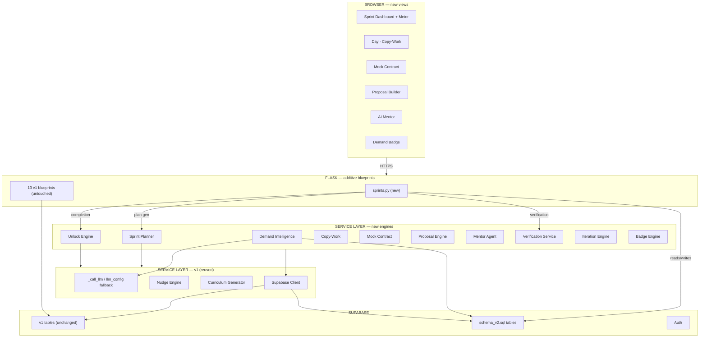
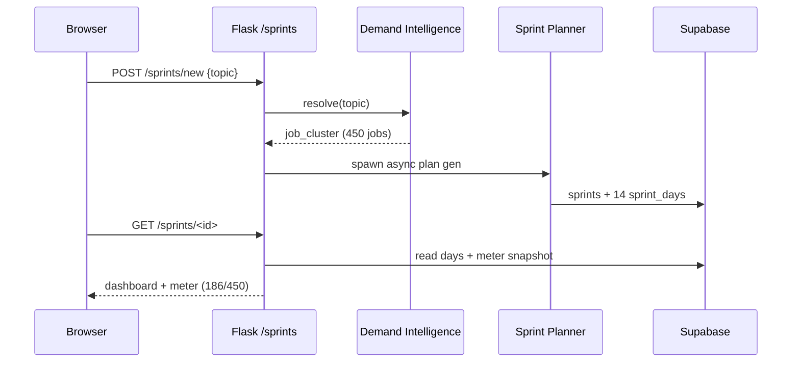
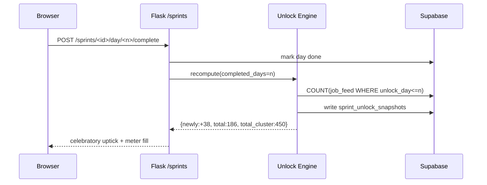

# FreelanceLaunch — Sprint Track Architecture (v2)

**Status:** Approved & building · **Version:** 2.0 · **Branch:** `sprint-track`
**Companions:** [`engineering-spec.md`](./engineering-spec.md) · [`schema_v2.sql`](../../schema_v2.sql)

---

## 1. Overview

The Sprint Track adds a **parallel, outcome-focused placement path** to the existing FreelanceLaunch monolith. It is deliberately *additive*: the v1 Flask app, its 13 blueprints, services, and schema are untouched. New code is a thin layer that reuses v1 machinery (LLM fallback chain, async generation, nudge engine, pipeline).

The three pillars of the design:

1. **Demand-first**: every sprint is generated from a *live job cluster* — the feed, the badges, and the Unlock Meter all read the same `job_feed` source of truth.
2. **Motivation via unlocking**: the **Job Unlock Meter** converts abstract demand numbers into a fillable, per-day reward (§2 of the eng spec).
3. **Fulfillment gate**: Phase B's Mock Contract must pass verification before bidding, making the sprint's badge credible.

---

## 2. Architecture diagram (Mermaid)

---

## 3. Layered architecture

### 3.1 Browser layer
New server-rendered Jinja2 views: sprint dashboard (with meter), phase-day view, mock contract, proposal builder, AI mentor, and badge. Server-rendered for consistency with v1 (no SPA).

### 3.2 Application layer
A single new `sprints` blueprint registers additively in `app.py`. All new endpoints live under `/sprints/*` and `/mentor`. No v1 route is modified.

### 3.3 Service layer
New engines (listed in §4 of eng spec). They talk to Supabase and the LLM fallback chain exactly like v1 services. They are pure-ish modules callable in-request (meter recompute, mentor) or in-thread (plan generation).

### 3.4 Data layer
v1 tables untouched. `schema_v2.sql` adds the sprint/job/badge/mentor tables. Access via the existing service-role client.

---

## 4. Key data flows

### 4.1 Enroll → plan → meter

### 4.2 Day completion → unlock uptick

### 4.3 Mock Contract verification gate
Phase C stays locked until `verification_reviews.status = pass`. `verification_service` runs auto-tests (code) or enqueues peer review (design/copy).

---

## 5. LLM & async strategy
- All new LLM work reuses `_call_llm` / `llm_config` (v1 fallback chain). No new provider logic.
- **Plan generation** is async with a DB-backed progress log + polling (v1 `generate_api` pattern).
- **Mentor** is request-scoped, short (2–4s), with a 20s timeout + graceful fallback.
- **Badge counter** recompute is a daily cron, not request-time.

---

## 6. Concurrency & jobs

| Job | Trigger | Mechanism |
|-----|---------|-----------|
| Sprint plan generation | POST /sprints/new | background thread, DB-backed log |
| Badge counter recompute | daily cron | `badge_engine` |
| Verification (auto) | POST contract/submit | inline auto-test |
| Verification (peer) | POST contract/submit | enqueued review queue |

---

## 7. Security & resilience
- service-role for MVP (v1 stance); badge + job counters are public read pre-launch.
- Never 500: missing plan → regenerate prompt; missing meter → compute on the fly; missing cluster → redirect to picker.
- Capstone briefs store only `job_feed_id`, never client PII.
- Proposals never auto-submit.

---

## 8. Scaling (delta)
Unlock Meter reads `sprint_unlock_snapshots` (not a live COUNT) — O(1) per render. `job_feed` is indexed on `(cluster_key, unlock_day)`. At >1k concurrent, move meter counts into a materialized/cached counter (still cheap).

---

*References: `engineering-spec.md`, `schema_v2.sql`, v1 `architecture.md`.*
